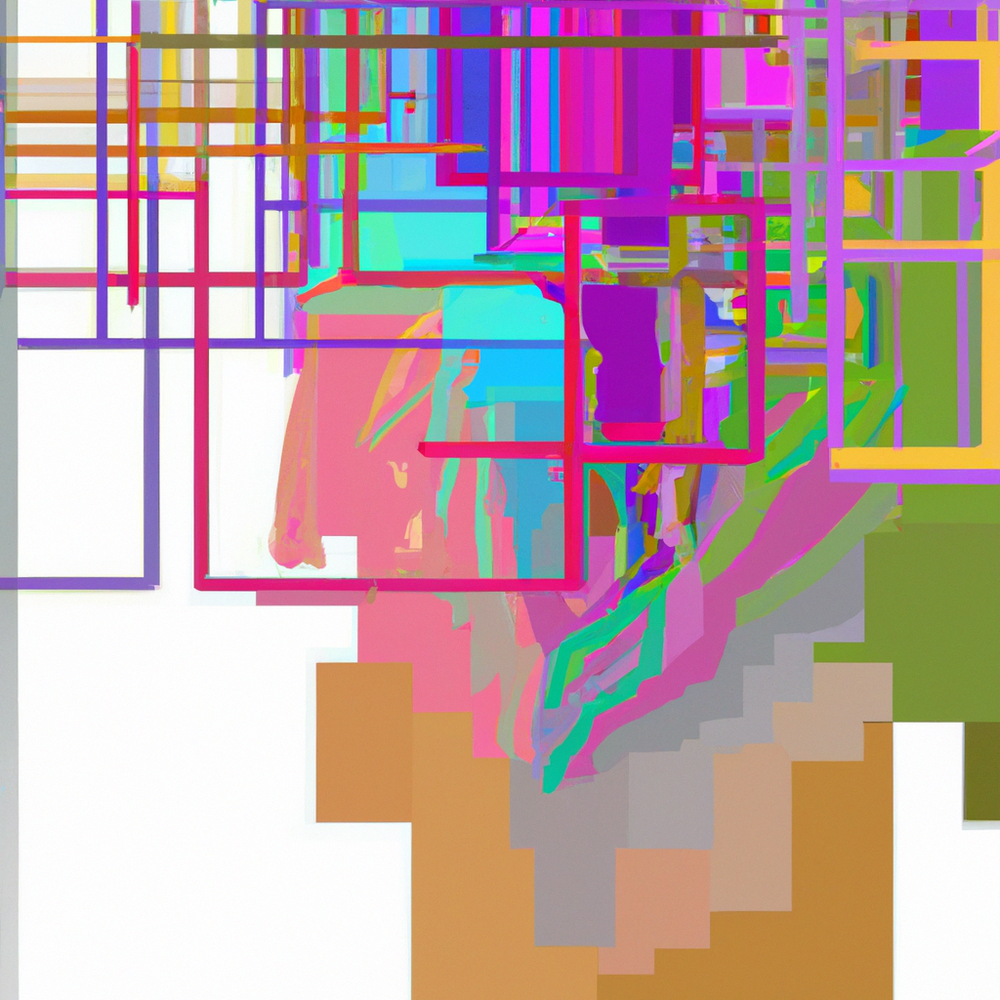
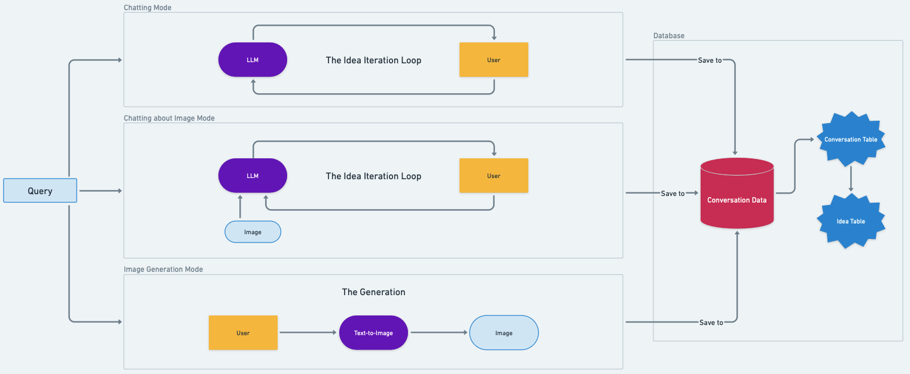

# ArtBuddy

<div style="text-align: center;">
  
</div>

ArtBuddy is an AI-powered art assistant that combines image generation, analysis, and conversational capabilities. It leverages OpenAI's models to provide a comprehensive art creation and analysis experience.

## Features

- **Image Generation**: Create stunning images from text prompts using OpenAI's DALL-E 3 model
- **Image Analysis**: Analyze and discuss images with AI-powered insights
- **Conversational AI**: Engage in meaningful conversations about art and design
- **Idea Management**: Store and retrieve creative ideas for future reference
- **Database Integration**: Persistent storage of conversations and generated content
- **Agent-based Architecture**: Smart agents for handling complex tasks and web searches

## Architecture

ArtBuddy is built with a modular architecture consisting of several core components:

- **Model Core**: Handles interactions with OpenAI's models for text and image processing
- **Agent Core**: Manages AI agents for complex tasks and web searches
- **Database Core**: Provides persistent storage for conversations and ideas
- **Tools**: Custom tools for image analysis and other specialized tasks
- **Runner**: Orchestrates the interaction between different components

## Installation

1. Clone the repository:

```bash
git clone https://github.com/yourusername/ArtBuddy.git
cd ArtBuddy
```

2. Install uv package manager if you haven't already:

```bash
curl -LsSf https://astral.sh/uv/install.sh | sh
```

3. Run the application:

```bash
uv run main.py
```

The application will automatically:

- Create necessary directories
- Set up the database
- Configure logging
- Initialize all required components

4. Configure your environment:

- Copy `.env.example` to `.env`:

```bash
cp .env.example .env
```

- Edit `.env` and add your OpenAI API token
- Optionally modify other configuration parameters:
  - `MODEL_NAME`: The text model to use
  - `IMAGE_MODEL_NAME`: The image model to use
  - `VERBOSE`: Enable/disable verbose logging
  - `PLANNING_INTERVAL`: Interval for agent planning
  - `MAX_STEPS`: Maximum steps for agent operations
  - `VERBOSITY`: Verbosity level for logging
  - `DATABASE_PATH`: Path to the database file

## Usage

### Basic Usage

Run the main application:

```bash
uv run main.py
```

### Advanced Usage
The following is a simple overview of the capbilities that ArtBuddy has. You can try to test any of them based on the guide provided in the following.

<div style="text-align: center;">
  
</div>

You can directly use the Runner class with your own arbitrary modes.

#### 1. Image Generation

With the following code snippet, you can either simply run the image generator model with your prompt or use the ideas that are saved inside the `idea` table of the `ArtBuddy.db` database.

```python
# Basic image generation
runner.run(
    mode="generatingImage",
    user_prompt="A beautiful sunset over mountains"
)

# Image generation with ideas from previous conversations
runner.run(
    mode="generatingImage",
    user_prompt="Create an abstract painting",
    use_ideas=True
)
```

#### 2. Image Analysis

With the following code snippet you can start discussing your chosen image with the model. There is an agentic approach here which gives more thought to its generation.

```python
# Basic image analysis
runner.run(
    mode="chattingImage",
    user_prompt="Describe this image",
    img_path="path/to/image.jpg"
)

# Agent-based image analysis (more sophisticated analysis)
runner.run(
    mode="chattingImage",
    agent_mode=True,
    user_prompt="Analyze the composition and color theory in this image",
    img_path="path/to/image.jpg"
)
```

#### 3. Conversational Modes

Moreover, we have also created the conversational mode where you can discuss your ideas with the model or the agent. ALl the discussion will be saved into the database and as it is apparent from the code, the program after each 10 conversation that user begins, summarizes them and saves them into the idea table. This is also the same in the previous running modes.

```python
# Basic chat
runner.run(
    mode="chatting",
    user_prompt="Tell me about art history"
)

# Agent-based chat (for complex queries and research)
runner.run(
    mode="chatting",
    agent_mode=True,
    user_prompt="Research modern art movements and their influence on contemporary design"
)
```

#### Idea Management

The following line of code will summarizes the conversation into the idea table from which you can benefit when you are in the analyzing or generating mode.

The `exclude_image=True` helps to not consider saving the images in the ideas table as it can increase the prompts' length significantly.

```python
# Summarize ideas from recent conversations
runner.sumUpIdeas(top_k=10, exclude_image=True)  # Summarizes the last 10 conversations
```

### Mode Parameters

The `runner.run()` method accepts the following parameters:

- `mode`: The operation mode
  - `"generatingImage"`: Generate images from text prompts
  - `"chattingImage"`: Analyze and discuss images
  - `"chatting"`: Engage in text-based conversation

- `agent_mode`: Boolean flag to enable agent-based processing
  - `True`: Uses AI agents for more sophisticated analysis and research
  - `False`: Uses direct model interaction

- `user_prompt`: The input text for the operation

- `img_path`: Path to the image file (required for image analysis modes)

- `use_ideas`: Boolean flag to incorporate previous ideas
  - `True`: last idea is retrieved from the `idea` table.
  - `False`: Generates content without considering previous ideas you discussed

## Configuration

ArtBuddy can be configured through environment variables in the `.env` file:

- `MODEL_PROVIDER`: The AI model provider (e.g., "openai")
- `MODEL_NAME`: The name of the text model to use
- `IMAGE_MODEL_NAME`: The name of the image model to use
- `OPENAI_TOKEN`: Your OpenAI API token
- `VERBOSE`: Enable/disable verbose logging
- `PLANNING_INTERVAL`: Interval for agent planning
- `MAX_STEPS`: Maximum steps for agent operations
- `VERBOSITY`: Verbosity level for logging
- `DATABASE_TYPE`: Type of database to use
- `DATABASE_PATH`: Path to the database file

## Project Structure

```
ArtBuddy/
├── src/
│   └── core/
│       ├── agent.py
│       ├── database.py
│       ├── logging_config.py
│       ├── model.py
│       ├── prompts.py
│       ├── runner.py
│       ├── tools.py
│       └── utils.py
├── main.py
└── README.md
```

## Contributing

Contributions are welcome! Please feel free to submit a Pull Request.

If you want to contribute but you don't know where to start, you can simply try running the model with the different running modes explained here. Then, after grasping how the runner is working, you move one step further to implement a UI interface using Gradio, trying to received the modes and paramteres from the interface.
